# ao

Admin Operations (`ao`) is a centralized, unified command line wrapper written in Rust designed to perform sysop operations across fragmented Linux environments. Instead of context-switching between `apt`, `dnf`, `systemctl`, `usermod`, and `ip`, you just use `ao`.

## Philosophy

* **Ergonomic Speed:** Fast, predictable muscle memory (`ao <domain> <action>`).
* **Zero Overhead:** Instantaneous startup time via Rust.
* **Abstraction:** Hides the differences between Debian, Fedora, Arch, etc.

## Feature Support Matrix

This matrix tracks the current implementation status of the syntax tree defined in `SPEC.md`. Because `ao` abstracts the underlying Operating System, some features may only be implemented for specific backend distributions (e.g., Debian/Ubuntu vs Fedora/RHEL).

| Domain | Sub-domain | Description | Status | Level of Support |
| :--- | :--- | :--- | :--- | :--- |
| `ao sys` | Core System | Updates, power, time | ✅ Implemented | Generic Linux |
| `ao svc` | Services | Start, stop, list services (`systemctl`) | ✅ Implemented | Debian/Ubuntu (Systemd) |
| `ao user` | Users | Add, remove, modify users | ✅ Implemented | Generic Linux |
| `ao group` | Groups | Add, remove, modify groups | ✅ Implemented | Generic Linux |
| `ao net` | Networking | Interfaces, IPs, routes | ✅ Implemented | Generic Linux |
| `ao net fw` | Firewall | Allow, block, status | ✅ Implemented | Generic Linux |
| `ao net wifi` | Wi-Fi | Scan, connect, forget | ✅ Implemented | Generic Linux |
| `ao disk` | Storage | Mount, unmount, usage | ✅ Implemented | Generic Linux |
| `ao pkg` | Packages | Install, remove, update | ✅ Implemented | Debian/Ubuntu (`apt`) |
| `ao log` | Logs | Tail service and system logs | ✅ Implemented | Generic Linux |
| `ao boot` | Boot & Kernel | Bootloader defaults, kernel modules | ✅ Implemented | Generic Linux |
| `ao gui` | Displays | Wayland/X11 detect, resolution | ✅ Implemented | Generic Linux |
| `ao dev` | Devices | PCI/USB lists, Bluetooth, Printers | ✅ Implemented | Generic Linux |
| `ao virt` | Virtualization | Docker, Podman, libvirt abstraction | ✅ Implemented | Generic Linux |
| `ao sec` | Security | SELinux/AppArmor contexts, audits | ✅ Implemented | Generic Linux |
| `ao distro` | Distributions | OS info, major release upgrades | ✅ Implemented | Generic Linux |

## Architecture

`ao` relies on an abstraction layer (`src/os/mod.rs`). The CLI (`src/cli.rs`) routes commands to the `Detector` (`src/os/detector.rs`), which reads `/etc/os-release` and returns a Boxed Trait Object implementing the necessary command logic (e.g., `Apt` or `Systemd` in `src/os/debian.rs`).

## Command Tree

```mermaid
graph TD
    A[ao] --> B(pkg)
    A --> C(svc)
    A --> D(user)
    A --> E(group)
    A --> F(disk)
    A --> G(sys)
    A --> H(log)
    A --> I(distro)
    A --> J(net)
    A --> K(boot)
    A --> L(gui)
    A --> M(dev)
    A --> N(virt)
    A --> O(sec)
    A --> P(completions)

    B --> B1(update)
    B --> B2(install)
    B --> B3(remove)
    B --> B4(search)
    B --> B5(list)

    C --> C1(list)
    C --> C2(up)
    C --> C3(down)
    C --> C4(restart)
    C --> C5(reload)
    C --> C6(status)

    D --> D1(list)
    D --> D2(add)
    D --> D3(del)
    D --> D4(mod)
    D --> D5(passwd)

    E --> E1(list)
    E --> E2(add)
    E --> E3(del)
    E --> E4(mod)

    F --> F1(list)
    F --> F2(mount)
    F --> F3(unmount)
    F --> F4(usage)

    G --> G1(info)
    G --> G2(power)
    G --> G3(time)

    H --> H1(tail)
    H --> H2(sys)
    H --> H3(file)

    I --> I1(info)
    I --> I2(upgrade)

    J --> J1(interfaces)
    J --> J2(ips)
    J --> J3(routes)
    J --> J4(fw)
    J --> J5(wifi)

    J4 --> J4_1(status)
    J4 --> J4_2(allow)
    J4 --> J4_3(deny)

    J5 --> J5_1(scan)
    J5 --> J5_2(connect)

    K --> K1(list)
    K --> K2(mod)

    K2 --> K2_1(list)
    K2 --> K2_2(load)
    K2 --> K2_3(unload)

    L --> L1(info)
    L --> L2(display)

    L2 --> L2_1(list)

    M --> M1(list)
    M --> M2(pci)
    M --> M3(usb)
    M --> M4(bt)
    M --> M5(print)

    M4 --> M4_1(status)
    M4 --> M4_2(scan)
    M4 --> M4_3(pair)
    M4 --> M4_4(connect)
    M5 --> M5_1(list)

    N --> N1(ps)
    N --> N2(start)
    N --> N3(stop)
    N --> N4(rm)
    N --> N5(logs)

    O --> O1(audit)
    O --> O2(context)

    P --> P1(generate)
    P --> P2(install)
    P --> P3(setup)
```

